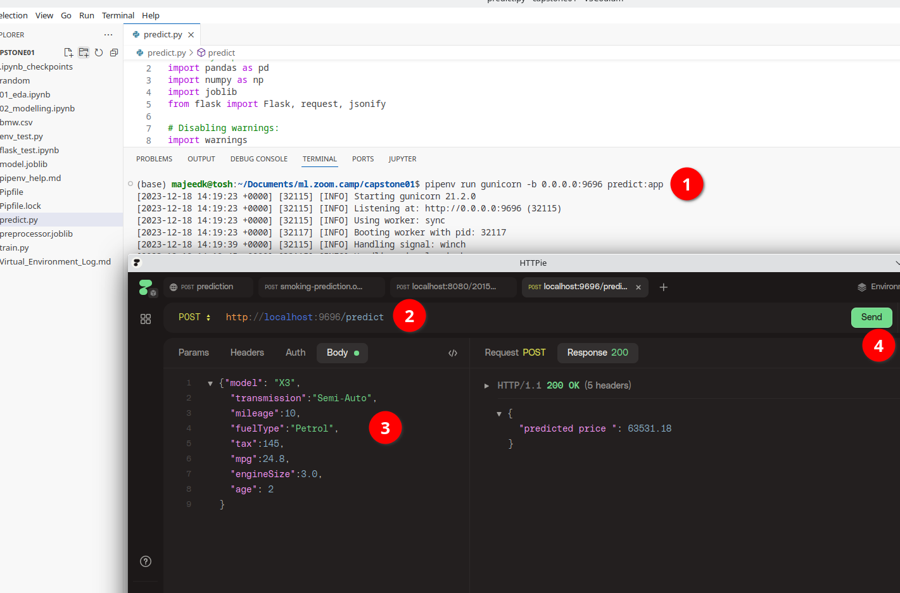

# Captstone Project 1: Used car price prediction

## Problem description
The Goal of this project is to build a used car price prediction model. I used the **100,000 UK Used Car Data set** available from https://www.kaggle.com/datasets/adityadesai13/used-car-dataset-ford-and-mercedes/data 

This dataset consists of 13 files, each for a different manufacture. The dataset was collected from UK car sales data. For the purpose of this project I will only be using car sales data for **BMW** cars

Dataset Features:

```
 #   Column        Non-Null Count  Dtype  
---  ------        --------------  -----  
 0   model         10781 non-null  object 
 1   year          10781 non-null  int64  
 2   price         10781 non-null  int64  
 3   transmission  10781 non-null  object 
 4   mileage       10781 non-null  int64  
 5   fuelType      10781 non-null  object 
 6   tax           10781 non-null  int64  
 7   mpg           10781 non-null  float64
 8   engineSize    10781 non-null  float64
```
  
**I have used a local copy of data file in the project and made it available within the repository.**

## Exploratory data analysis and data cleaning

Please refer to `01_eda.ipynb` for detailed version of the analysis. Below are some of the findings:

1. The dataset has 10781 entries and 9 columns whose names are self explanatory.
2. There are no null values in the data
3. There are 117 duplicated records in the dataset
4. Price is negatively correlated with mileage and age which is logical as older cars will usually have higher mileage and command lower sale price compared to new cars with lower mileage
5. Engine Size has positive correlation with price - again it is logical that car with bigger engine size teand to be luxury of business cars hence they will be more expensive
6. MPG has weak negavtive correlation with price. Similar to previous point, luxury cars have bigger engines and lower MPG but they still have higher price becasue of their luxury aspect
7. Age and higly correlated with mileage, which is logical as older vehicles tend to have higher mileage.

## data transformation and feature engineering

1. I introduced `Age` feature to replace `year` in the data. The sale data was from `2022` so the age of the cars was calculated using that year.
2. For `fuelType` there are only 3 example of `Electric` so it was merged with `Other` 
3. The `model` feature had leading whitespaces and also between the words. These white spaces were removed.
4. Outlier analysis suggested that we have some outliers in the data, but upon inspected only one car at index `3638` had abnormally high price `123456` which was removed from our data.
5. Catagiorical features `model`, `transmission` and `fuelType` were encode with `OneHotEncoder`
6. Numerical features `mileage`, `mpg`, `engineSize` and `age` were normalised with `PowerTransformer` using `yeo-johnson` method

## Modelling and hyper parameter tuning

The notebook `02_modelling.ipynb` contains the code for machine learning model creation. I trained 3 different models using `GridSearchCV` and used `R^2` as performance metric

|MODEL                  |R2 Metric  |
|-----------------------|-----------|
|DecisionTreeRegressor  |0.759436   |
|BaggingRegressor       |0.960218   |
|RandomForestRegressor  |0.899508   |

Since `BaggingRegressor` was the best model, I used it with best parameters from `GridSearchCV` which were `max_features= 1.0`, `max_samples = 0.7` and `n_estimators = 50`

## Training final model

The code for training the final model can be found in `train.py` file. I saved the preprocessor ads `preprocessor.joblib` and mode  as `model.joblib`

## Prediction Service

I used flask to create prediction service which takes in jason object containing features of the car and returns predicted price. The code for this service is located in `predict.py` file

Please refer to `Virtual_Environment_Log.md` for details logs of how I used virtual environment for setting up a Flask web service. In summary, open terminal, navigate to code directory and run following commands

```bash
pipenv --python 3.11
pipenv install pandas scikit-learn Flask gunicorn
```

Now to run the prediction service execute the following command

```bash
pipenv run gunicorn -b 0.0.0.0:9696 predict:app
```

T test the prediction service, youi have two options

**Option 1:** Execute the file `flask_test.ipynb`
**Option 2:** Use application like HTTPie or Postman. 

The output of my testing can viewed 

## Containerisation

I have supplied logs of building and running the web service via docker container in `docker_deploy_log.md` file. To sumnmarise, navigate to oroject folder in terminal and execute following commands 

```bash
sudo docker build -t car-price-prediction-service .
sudo docker run -it -p 9696:9696 car-price-prediction-service
```

To test the prediction service, you can use applications like `HTTPie` or `Postman`.

The output of my testing can viewed  

## Cloud Service

I have used `Render.com` cloud platform which offers a free tier for testing purposing. You just have to connect GitHub account and it can pick choose the repo where Docker file is located. The instance of my service is located at https://car-price-prediction-rnnk.onrender.com

Since this is a free instance, it is very likely that at the time of testing Render.com would have alreay shut the instance down due to inactivity. So i will urge you to use the output of my testing from following screen shot  

